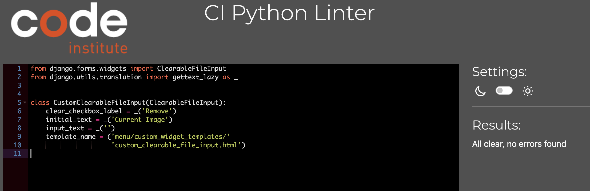
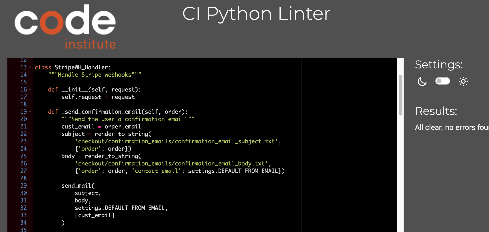
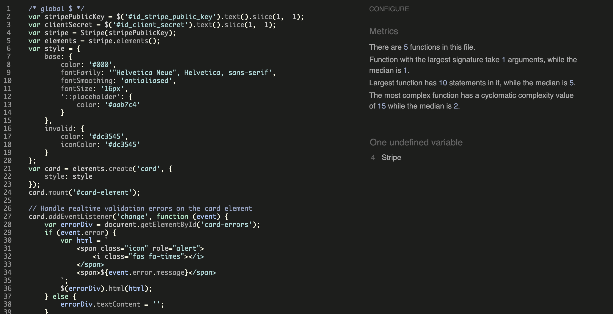
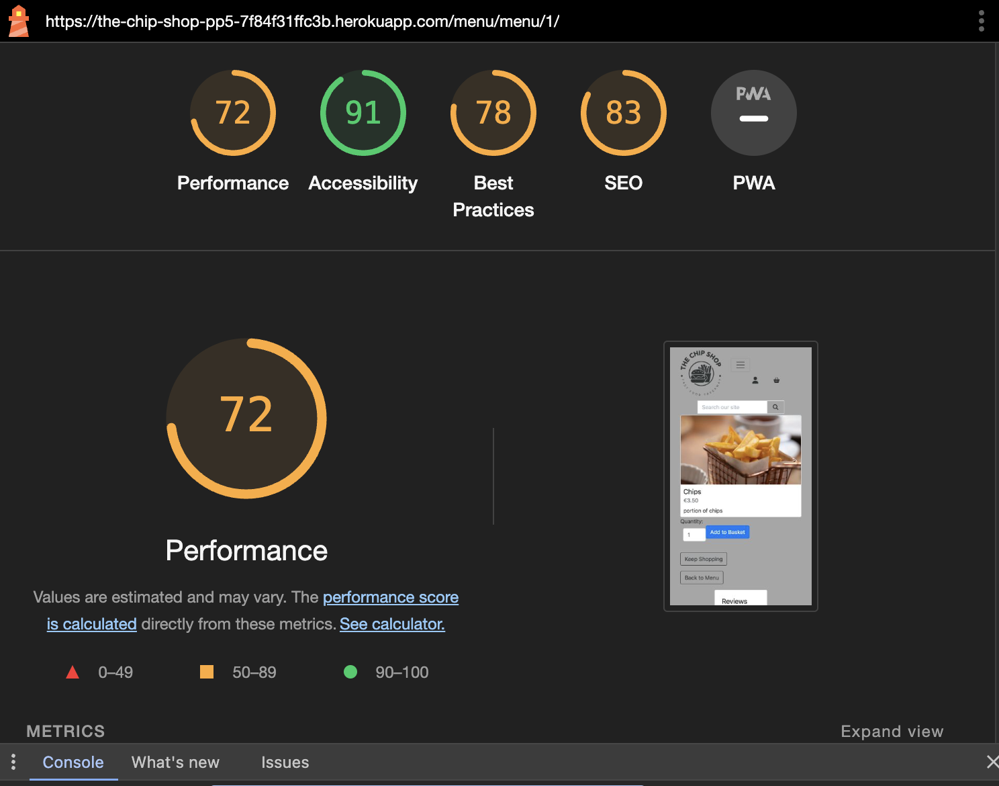

## Manual Testing
Browsers and Devices
* I have tested the site  on Chrome, Safari and Firefox
* I have tested the site on different screen sizes to confirm it is responsive mobile, Ipad and Desktop 
* I have tested all links to confirm they are functioning.
---

### Navigation Bar
| Feature               | Action     | Expected Result                                                    | Pass/Fail |
|-----------------------|------------|--------------------------------------------------------------------|-----------|
|  Home Button                 | Click      |  Redirects to home page                                            |    Pass   |
|  Menu                | Click      |  Opens to Menu page                                            |    Pass   |
|Contact Us                | Click      |  Opens Inquire form  page                                            |    Pass   |
|  My Account                | Click      |  Opens login and register links                                           |    Pass   |
|  Register                | Click      |  Opens | sign up form page                                            |    Pass   |
|  Login                 | Click      |  Opens sign in form page                                            |    Pass   |
|  Basket               | Click      |  Opens | basket page  
---    

### Footer 
| Feature               | Action     | Expected Result                                                    | Pass/Fail |
|-----------------------|------------|--------------------------------------------------------------------|-----------|
|  Instagram icon     | Click      |  opens Instagram                                                  |    Pass   |
|  Facebook icon     | Click      |  opens Facebook                                                 |    Pass   |
|  TicToc icon     | Click      |  opens Tictoc         |Pass
|  Mail Chip     | enter email      |  Subscribes to newletter     |Pass
|  Privacy policy     | Click      |  Displays privacy policy   |Pass
---

### Sign up Page
| Feature               | Action     | Expected Result                                                    | Pass/Fail |
|-----------------------|------------|--------------------------------------------------------------------|-----------|
|   Register button   | Click      |  Open Sign up form                                                |    Pass   |
|  User name  field   | Empty    |  Form won't submit error Displayed                                               |    Pass   |
|  User name  field   | Worng format entered    |  Form won't submit error Displayed                                               |    Pass   |
|  User name  field   | Duplicate Name   |  Form won't submit error Displayed                                               |    Pass   |
| Email  field (optional)  | Empty    |  Form submitted                                             |    Pass   |
| Email  field (optional)  | Worng format entered     |  Form won't submit error Displayed                                              |    Pass   |
| Email  field (optional)  |  Duplicate Email |  Form won't submit error Displayed                  |    Pass   |
| Email  field (optional)  | With correct format  |  Form submitted                                             |    Pass   |
| Password  field  | With incorrect format  |  Form won't submit error Displayed                                             |    Pass   |
| Password Confirmation field  | With incorrect Match  |  Form won't submit error Displayed                                             |    Pass   |
| Password  field  | With correct format  |  Form submitted                                             |    Pass   |
|  Sign Up button   | Click      |  Submit form and displays success login message                                              |    Pass   |
|  Contuine button on success message   | Click      |  redirects to home page message                                             |    Pass   |

---

### Home Page
| Feature               | Action     | Expected Result                                                    | Pass/Fail |
|-----------------------|------------|--------------------------------------------------------------------|-----------|
|  Order Now Button      | Click      |  Open Menu page                                                 |    Pass   |
---
### Favorites Carousal
| Feature               | Action     | Expected Result                                                    | Pass/Fail |
|-----------------------|------------|--------------------------------------------------------------------|-----------|
|    Add to basket button | Click      |  adds item to basket                                                  |    Pass   |
|  Qty     | Click      |  increment or decreases amount of item user wants to buy                                                |    Pass   |
---

### Menu Page
| Feature               | Action     | Expected Result                                                    | Pass/Fail |
|-----------------------|------------|--------------------------------------------------------------------|-----------|
|  Add to basket Button      | Click      |  Add item to basket                                                 |    Pass   |
|  Category Navbar      | Click      | Displays only items in that category                                               |    Pass   |
|  Sort by      | Click      | Displays  by options                                            |    Pass   |
|  Search Bar    | type in word      | Displays  all options containing that word                                           |    Pass   |
| Item image      | Click      | Displays Menu detail page                                            |    Pass   |
| Add to favorites button      | Click      | Adds menuitem to favorites carousal on home page if user is logged in                                            |    Pass   |
---

### Menu detail Page
| Feature               | Action     | Expected Result                                                    | Pass/Fail |
|-----------------------|------------|--------------------------------------------------------------------|-----------|
|  Add to basket Button      | Click      |  Add item to basket                                                 |    Pass   |
|  Keep Shopping      | Click      | Displays menu page                                         |    Pass   |
|  
Leave review     | Click      | Displays review form page                                         |    Pass   | 
|  back to menu     | Click      | Displays menu page   | pass |
| Edit Button      | Click      |  Menu Managment page                                                 |    Pass   |
| Delete Button      | Click      |  Deletes Menuitem from menu                                                |    Pass   |
---

### Basket Page
| Feature               | Action     | Expected Result                                                    | Pass/Fail |
|-----------------------|------------|--------------------------------------------------------------------|-----------|
| Update Button      | Click      |  Add item to increase quantiy to basket                                                 |    Pass   | 
| + Button      | Click      |  Add item to increase quantiy to basket                                                 |    Pass   |
| - Button      | Click      |  Remove item to decrease quantiy in basket                                                 |    Pass   |
| Remove Button      | Click      |  Remove item to decrease quantiy in basket                                                 |    Pass   |
| Keep Shopping Button      | Click      |  Returns to Menu page                                               |    Pass   |
| Next Button      | Click      | Leads to Delivery option page page                                               |    Pass   |
| Item image      | Click      | Leads to Item detail page page                                               |    Pass   |
---

### Delivery Option  Page
| Feature               | Action     | Expected Result                                                    | Pass/Fail |
|-----------------------|------------|--------------------------------------------------------------------|-----------|
| Collection Button      | Click      |  Opens Checkout Page                                             |    Pass   | 
| Delivery Button order under €10     | Click      |  error message                                            |    Pass   | 
| Delivery Button order over €10     | Click      |              Opens Checkout Page                                  |    Pass   | 
---

### Checkout  Page
| Feature               | Action     | Expected Result                                                    | Pass/Fail |
|-----------------------|------------|--------------------------------------------------------------------|-----------|
|  Name input  |   empty |  error warning                                              |    Pass   | 
|  Email input  |   empty |  error warning                                              |    Pass   | 
|  Email input  |   empty |  error warning                                              |    Pass   | 
|  Email input  |   email address | no error warning                                              |    Pass   |
---
### Logout page
| Feature               | Action     | Expected Result                                                    | Pass/Fail |
|-----------------------|------------|--------------------------------------------------------------------|-----------|
|Logout Button      | Click      | logs user out                                              |    Pass   |
--- 
### Menu Management
| Feature               | Action     | Expected Result                                                    | Pass/Fail |
|-----------------------|------------|--------------------------------------------------------------------|-----------|
| Add item button    | Click      | As item to menu                                               |    Pass   |
| Cancel button    | Click      | Returns to menu page menu                                               |    Pass   |
--- 

### [CI Pythoon linter](https://pep8ci.herokuapp.com/) was use to test python code.

| The Chip Shop file                   |    Result    | 
|-----------------------------|------------|
| 

Settings.py

             | These errors are django set up code.   |
| 

urls.py

             | No errors   |
|

views.py

             | No errors   |
---

| Review App                  |    Result    | 
|-----------------------------|------------|
|

views.py

             | No errors   |
| 

urls.py

             | No errors   |
| 

models.py

             | No errors   |
|

forms.py

             | No errors   |
---

|  Menu App                  |    Result    | 
|-----------------------------|------------|
|

views.py

             | No errors   |
| 

urls.py

             | No errors   |
| 

models.py

             | No errors   |
|

views.py

             | No errors   |
---

| Profile App                  |    Result    | 
|-----------------------------|------------|
|

views.py

             | No errors   |
| 

urls.py

             | No errors   |
| 

models.py

             | No errors   |
|

forms.py

             | No errors   |
|

widgets.py

             | No errors   |
|

app.py

             | No errors   |
---

| Inquiry App                 |    Result    | 
|-----------------------------|------------|
|

views.py

             | No errors   |
| 

urls.py

             | No errors   |
| 

models.py

             | No errors   |
|

forms.py

             | No errors   |
|

admin.py

             | No errors   |
---

| Checkout  App                 |    Result    | 
|-----------------------------|------------|
|

views.py

             | No errors   |
| 

urls.py

             | No errors   |
| 

models.py

             | No errors   |
|

forms.py

             | No errors   |
|

admin.py

             | No errors   |
|

webhook.py

             | No errors   |
|

webhookhandler.py

             | No errors   |
|

webhook.py

             | No errors   |
|

signals.py

             | No errors   |
|

context.py

             | No errors   |
---

### HTML Validatior
#### [W3C](https://validator.w3.org/) was used for validation of Html and CSS
| Page                 |    Result    | 
|-----------------------------|------------|
|

Checkout Success

             | Error from Djanjo   |
| 

Base.html

             |  Error from Djanjo   |
| 

Mobile Top Header

             |  Error from Djanjo   |
| 

Base.html

             |  Error from Djanjo   |
| 

Mobile Top Header

             |  Error from Djanjo   |
| 

Footer.html

             |  Error from Djanjo   |
| 

Toast warning

             |  Error from Djanjo   |
| 

Toast Info

             |  Error from Djanjo   |
| 

Toast Errors

             |  Error from Djanjo   |
| 

500 Error Html

             |  Error from Djanjo   |
| 

500 Error Html

             |  Error from Djanjo   |
| 

Add Review

             |  Error from Djanjo   |
#### All Html page test all page have errors remaining due to django.
---

### CSS Validatior

| File                |    Result    | 
|-----------------------------|------------|
|

Base Css

             | No Errors  |
|

Checkout Css

             | No Errors  |
|

Profile Css

             | No Errors  |
All Css file pass validatiors with no errors or warnings
---

### JS Validatior

| File                 |    Result    | 
|-----------------------------|------------|
|

Countryfields js

             | No Errors  |
|

Stripe Elements Js

             | No Errors  |
|

Quantity inpuy Js

             | No Errors  |
---

### Lighthouse Testing
|  Page                  |    Result    | 
|-----------------------------|------------|
|

Home desktop

             | pass   |
|

Home Mobile

             | pass   |
|

Menu desktop

             | pass   |
|

Menu Mobile

             | pass   |
|

Contact Us desktop

             | pass   |
|

Contact Us Mobile

             | pass   |
|

Register desktop

             | pass   |
|

Register Mobile

             | pass   |
|

Login desktop

             | pass   |
|

Login Mobile

             | pass   |
|

Basket desktop

             | pass   |
|

Basket Mobile

             | pass   |
|

Menudetail desktop

             | pass   |
|

Menudetail Mobile

             | pass   |
|

Delivery option desktop

             | pass   |
|

Delivery Mobile

             | pass   |
|

Checkout desktop

             | pass   |
|

Checkout Mobile

             | pass   |

All Site Page pass lighthouse testing
---

### User Stories Testing
| #Number   |     User stories     | Pass |
|--------| ------------- | ------------- | 
|[#1](https://github.com/EdelCorbett/the-chip-shop-pp5/issues/1)   | As a Developer I can setup a project so that begin project  | Yes     | 
| [#2](https://github.com/EdelCorbett/the-chip-shop-pp5/issues/2)   |  As a Developer I can create a database so that store project  |  Yes  |
| [#3](https://github.com/EdelCorbett/the-chip-shop-pp5/issues/3)   | As a Developer I can Deploy project early so that I can continually test the application during development   |  Yes  |
|[#5](https://github.com/EdelCorbett/the-chip-shop-pp5/issues/5)   | As a user I can create an account so that i can access my account | Yes     | 
|[#6](https://github.com/EdelCorbett/the-chip-shop-pp5/issues/6)   | As a user I can login so that I can make an order | Yes     | 
|[#23](https://github.com/EdelCorbett/the-chip-shop-pp5/issues/23)   | As a customer I can create a profile so that i can review order history and personal information | Yes     |
|[#7](https://github.com/EdelCorbett/the-chip-shop-pp5/issues/7)   | As a customer, I want to browse the menu items available for order| Yes     | 
|[#25](https://github.com/EdelCorbett/the-chip-shop-pp5/issues/25)   | As a customer I can choose an item from the menu and view the items item page so that i can view all relevant information on the item| Yes     | 
|[#8](https://github.com/EdelCorbett/the-chip-shop-pp5/issues/8)   |As a customer I can add menu items to my basket so that i can make an online order | Yes     |
|[#9](https://github.com/EdelCorbett/the-chip-shop-pp5/issues/9)   |As a customer I can update or remove item form basket so that update my order | Yes     |
|[#12](https://github.com/EdelCorbett/the-chip-shop-pp5/issues/12)   | As a customer I can pay for my order securely using stripe | yes   |  
|[#14](https://github.com/EdelCorbett/the-chip-shop-pp5/issues/14)   | As a Customer I can receive an email so that i know my order is comfirmed and payment is accepted| yes   | 
|[#27](https://github.com/EdelCorbett/the-chip-shop-pp5/issues/27)   | As a user I can subscribe so that I can receive newsletter to be informed of new offers| yes   |
|[#4](https://github.com/EdelCorbett/the-chip-shop-pp5/issues/4)   | As a Developer I can an Admin Site so that the site can be updated by the Admin|Yes   |
|[#17](https://github.com/EdelCorbett/the-chip-shop-pp5/issues/17)   | As a Admin I can view customer inquiries so that i can contact and follow up on their inquiry|Yes   |
|[#15](https://github.com/EdelCorbett/the-chip-shop-pp5/issues/15)   |As an admin, I want to be able to manage menu items (add, edit, delete) |Yes   |
|[#18](https://github.com/EdelCorbett/the-chip-shop-pp5/issues/18)   | As a customer I can submit an inquiry form so that I can find out about booking party food| yes   | 
|[#19](https://github.com/EdelCorbett/the-chip-shop-pp5/issues/19)   | As a customer I can submit a review so that i can share my opinion with others| yes   |
|[#20](https://github.com/EdelCorbett/the-chip-shop-pp5/issues/20)   | As a customer I can edit my review so that should i change my opinion| yes   |
|[#21](https://github.com/EdelCorbett/the-chip-shop-pp5/issues/21)   | As a customer I can delete my review so that my review is not display| yes   |
|[#24](https://github.com/EdelCorbett/the-chip-shop-pp5/issues/24)   | As a customer I can add my favorite menu item to list so that I can access them easy of ordering| yes   | 
|[#22](https://github.com/EdelCorbett/the-chip-shop-pp5/issues/22)   | As a Admin I can create a newsletter subscripition so that I can keep customers informed of menu changes and deals| yes   |
---

### Stripe
Order comfirmation

---
Strip webhook intent successed

---

## Bugs

This buy was fixed

----

Unfortunately i could not fix this bug before submittion as i was out of time but as it is not causing double payment it is not affecting the user, I will fix the problem in the future