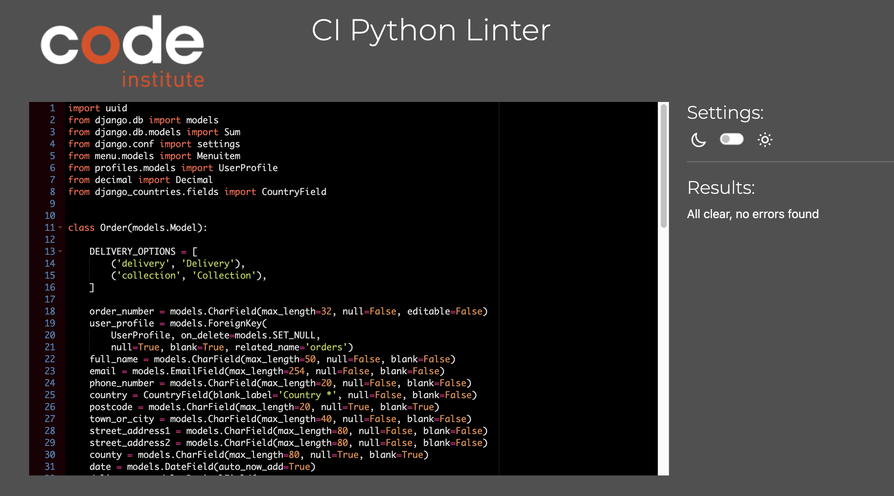

## Manual Testing
Browsers and Devices
* I have tested the site  on Chrome, Safari and Firefox
* I have tested the site on different screen sizes to confirm it is responsive mobile, Ipad and Desktop 
* I have tested all links to confirm they are functioning.

### Navigation Bar
| Feature               | Action     | Expected Result                                                    | Pass/Fail |
|-----------------------|------------|--------------------------------------------------------------------|-----------|
|  Home Button                 | Click      |  Redirects to home page                                            |    Pass   |
|  Menu                | Click      |  Opens to Menu page                                            |    Pass   |
|Contact Us                | Click      |  Opens Inquire form  page                                            |    Pass   |
|  My Account                | Click      |  Opens login and register links                                           |    Pass   |
|  Register                | Click      |  Opens | sign up form page                                            |    Pass   |
|  Login                 | Click      |  Opens sign in form page                                            |    Pass   |
|  Bascket               | Click      |  Opens | basket page      

### Footer 
| Feature               | Action     | Expected Result                                                    | Pass/Fail |
|-----------------------|------------|--------------------------------------------------------------------|-----------|
|  Instagram icon     | Click      |  opens Instagram                                                  |    Pass   |
|  Facebook icon     | Click      |  opens Facebook                                                 |    Pass   |
|  TicToc icon     | Click      |  opens Tictoc         |Pass
|  Mail Chip     | enter email      |  Subscribes to newletter     |Pass
|  Privacy policy     | Click      |  Displays privacy policy   |Pass

### Sign up Page
| Feature               | Action     | Expected Result                                                    | Pass/Fail |
|-----------------------|------------|--------------------------------------------------------------------|-----------|
|   Register button   | Click      |  Open Sign up form                                                |    Pass   |
|  User name  field   | Empty    |  Form won't submit error Displayed                                               |    Pass   |
|  User name  field   | Worng format entered    |  Form won't submit error Displayed                                               |    Pass   |
|  User name  field   | Duplicate Name   |  Form won't submit error Displayed                                               |    Pass   |
| Email  field (optional)  | Empty    |  Form submitted                                             |    Pass   |
| Email  field (optional)  | Worng format entered     |  Form won't submit error Displayed                                              |    Pass   |
| Email  field (optional)  |  Duplicate Email |  Form won't submit error Displayed                  |    Pass   |
| Email  field (optional)  | With correct format  |  Form submitted                                             |    Pass   |
| Password  field  | With incorrect format  |  Form won't submit error Displayed                                             |    Pass   |
| Password Confirmation field  | With incorrect Match  |  Form won't submit error Displayed                                             |    Pass   |
| Password  field  | With correct format  |  Form submitted                                             |    Pass   |
|  Sign Up button   | Click      |  Submit form and displays success login message                                              |    Pass   |
|  Contuine button on success message   | Click      |  redirects to home page message                                             |    Pass   |

### Home Page
| Feature               | Action     | Expected Result                                                    | Pass/Fail |
|-----------------------|------------|--------------------------------------------------------------------|-----------|
|  Order Now Button      | Click      |  Open Menu page                                                 |    Pass   |
### Menu Page
| Feature               | Action     | Expected Result                                                    | Pass/Fail |
|-----------------------|------------|--------------------------------------------------------------------|-----------|
|  Add to basket Button      | Click      |  Add item to basket                                                 |    Pass   |
|  Category Navbar      | Click      | Displays only items in that category                                               |    Pass   |
|  Sort by      | Click      | Displays  by options                                            |    Pass   |
|  Search Bar    | type in word      | Displays  all options containing that word                                           |    Pass   |
| Item image      | Click      | Displays Menu detail page                                            |    Pass   |

### Menu detail Page
| Feature               | Action     | Expected Result                                                    | Pass/Fail |
|-----------------------|------------|--------------------------------------------------------------------|-----------|
|  Add to basket Button      | Click      |  Add item to basket                                                 |    Pass   |
|  Keep Shopping      | Click      | Displays menu page                                         |    Pass   |
|  
Leave review     | Click      | Displays review form page                                         |    Pass   | 
|  back to menu     | Click      | Displays menu page   | pass |
| Edit Button      | Click      |  Menu Managment page                                                 |    Pass   |

### Basket Page
| Feature               | Action     | Expected Result                                                    | Pass/Fail |
|-----------------------|------------|--------------------------------------------------------------------|-----------|
| Update Button      | Click      |  Add item to increase quantiy to basket                                                 |    Pass   | 
| + Button      | Click      |  Add item to increase quantiy to basket                                                 |    Pass   |
| - Button      | Click      |  Remove item to decrease quantiy in basket                                                 |    Pass   |
| Remove Button      | Click      |  Remove item to decrease quantiy in basket                                                 |    Pass   |
| Keep Shopping Button      | Click      |  Returns to Menu page                                               |    Pass   |
| Next Button      | Click      | Leads to Delivery option page page                                               |    Pass   |
| Item image      | Click      | Leads to Item detail page page                                               |    Pass   |

### Delivery Option  Page
| Feature               | Action     | Expected Result                                                    | Pass/Fail |
|-----------------------|------------|--------------------------------------------------------------------|-----------|
| Collection Button      | Click      |  Opens Checkout Page                                             |    Pass   | 
| Delivery Button order under €10     | Click      |  error message                                            |    Pass   | 
| Delivery Button order over €10     | Click      |              Opens Checkout Page                                  |    Pass   | 

### Checkout  Page
| Feature               | Action     | Expected Result                                                    | Pass/Fail |
|-----------------------|------------|--------------------------------------------------------------------|-----------|
|  Name input  |   empty |  error warning                                              |    Pass   | 
|  Email input  |   empty |  error warning                                              |    Pass   | 
|  Email input  |   empty |  error warning                                              |    Pass   | 
|  Email input  |   email address | no error warning                                              |    Pass   |

### [CI Pythoon linter](https://pep8ci.herokuapp.com/) was use to test python code.

| The Chip Shop file                   |    Result    | 
|-----------------------------|------------|
| 

Settings.py

             | These errors are django set up code.   |
| 

urls.py

             | No errors   |
|

views.py

             | No errors   |

| Review App                  |    Result    | 
|-----------------------------|------------|
|

views.py

             | No errors   |
| 

urls.py

             | No errors   |
| 

models.py

             | No errors   |
|

forms.py

             | No errors   |

|  Menu App                  |    Result    | 
|-----------------------------|------------|
|

views.py

             | No errors   |
| 

urls.py

             | No errors   |
| 

models.py

             | No errors   |
|

views.py

             | No errors   |

| Profile App                  |    Result    | 
|-----------------------------|------------|
|

views.py

             | No errors   |
| 

urls.py

             | No errors   |
| 

models.py

             | No errors   |
|

forms.py

             | No errors   |
|

widgets.py

             | No errors   |
|

app.py

             | No errors   |

| Inquiry App                 |    Result    | 
|-----------------------------|------------|
|

views.py

             | No errors   |
| 

urls.py

             | No errors   |
| 

models.py

             | No errors   |
|

forms.py

             | No errors   |
|

admin.py

             | No errors   |

| Checkout  App                 |    Result    | 
|-----------------------------|------------|
|

views.py

             | No errors   |
| 

urls.py

             | No errors   |
| 

models.py

             | No errors   |
|

forms.py

             | No errors   |
|

admin.py

             | No errors   |
|

webhook.py

             | No errors   |
|

webhookhandler.py

             | No errors   |
|

webhook.py

             | No errors   |
|

signals.py

             | No errors   |
|

context.py

             | No errors   |

### HTML Validatior
#### [W3C](https://validator.w3.org/) was used for validation of Html and CSS
| Page                 |    Result    | 
|-----------------------------|------------|
|

Checkout Success

             | Error from Djanjo   |
| 

Base.html

             |  Error from Djanjo   |
| 

Mobile Top Header

             |  Error from Djanjo   |
| 

Base.html

             |  Error from Djanjo   |
| 

Mobile Top Header

             |  Error from Djanjo   |
| 

Footer.html

             |  Error from Djanjo   |
| 

Toast warning

             |  Error from Djanjo   |
| 

Toast Info

             |  Error from Djanjo   |
| 

Toast Errors

             |  Error from Djanjo   |
| 

500 Error Html

             |  Error from Djanjo   |
| 

500 Error Html

             |  Error from Djanjo   |
| 

Add Review

             |  Error from Djanjo   |
All Html page test all page have errors remaining due to django.

### CSS Validatior

| File                |    Result    | 
|-----------------------------|------------|
|

Base Css

             | No Errors  |
|

Checkout Css

             | No Errors  |
|

Profile Css

             | No Errors  |
All Css file pass validatiors with no errors or warnings

### JS Validatior

| File                 |    Result    | 
|-----------------------------|------------|
|

Countryfields js

             | No Errors  |
|

Stripe Elements Js

             | No Errors  |
|

Quantity inpuy Js

             | No Errors  |

