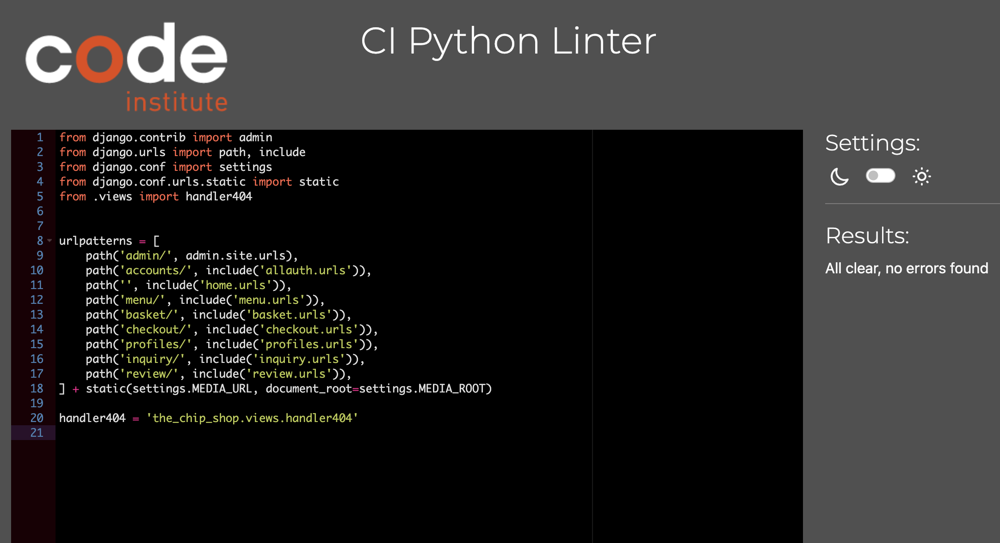

### [CI Pythoon linter](https://pep8ci.herokuapp.com/) was use to test python code.

| The Chip Shop file                   |    Result    | 
|-----------------------------|------------|
| 

Settings.py

             | These errors are django set up code.   |
| 

urls.py

             | No errors   |
|

views.py

             | No errors   |

| Review App                  |    Result    | 
|-----------------------------|------------|
|

views.py

             | No errors   |
| 

urls.py

             | No errors   |
| 

models.py

             | No errors   |
|

forms.py

             | No errors   |

| Profile App                  |    Result    | 
|-----------------------------|------------|
|

views.py

             | No errors   |
| 

urls.py

             | No errors   |
| 

models.py

             | No errors   |
|

forms.py

             | No errors   |

|  Menu App                  |    Result    | 
|-----------------------------|------------|
|

views.py

             | No errors   |
| 

urls.py

             | No errors   |
| 

models.py

             | No errors   |
| Profile App                  |    Result    | 
|-----------------------------|------------|
|

views.py

             | No errors   |
| 

urls.py

             | No errors   |
| 

models.py

             | No errors   |
|

forms.py

             | No errors   |
| Profile App                  |    Result    | 
|-----------------------------|------------|
|

views.py

             | No errors   |
| 

urls.py

             | No errors   |
| 

models.py

             | No errors   |
|

widgets.py

             | No errors   |